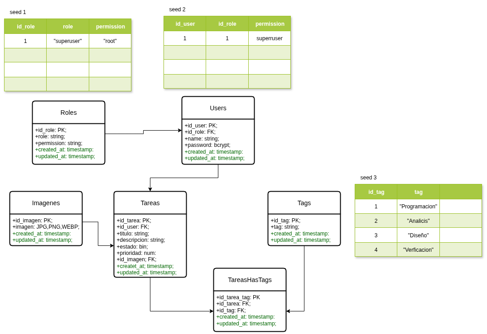

# TaskMaster - Organizador de Tareas para Prueba Tecnica

- **Autor**: Luis Alberto Batalla Gonzalez
- **Correo electronico**: luisalbagoz@gmail.com
- **GitHub**: LuisAlbertoB

---

## 1. Entidades Encontradas y Diagrama Entidad-Relacion



1. **Roles (`roles`)**: Almacena los roles de acceso del sistema.
   - `id_role`: Clave primaria (PK).
   - `role`: Nombre unico del rol (ej: "superuser", "user").
   - `permission`: Nivel de acceso asociado al rol (ej: "root", "user").
   - `created_at` / `updated_at`: Marcas de tiempo para auditoria.

2. **Users (`users`)**: Almacena las cuentas de los usuarios autenticados.
   - `id_user`: Clave primaria (PK).
   - `id_role`: Clave foranea (FK) hacia Roles.
   - `name`: Nombre de usuario unico utilizado para iniciar sesion.
   - `password`: Contraseña encriptada con Bcrypt.
   - `created_at` / `updated_at`: Marcas de tiempo para auditoria.

3. **Tareas (`tareas`)**: Registra las tareas creadas en el sistema.
   - `id_tarea`: Clave primaria (PK).
   - `id_user`: Clave foranea (FK) hacia Users (propietario de la tarea).
   - `titulo`: Título descriptivo de la tarea.
   - `descripcion`: Contenido o detalle de la tarea.
   - `estado`: Valor booleano (0 = Pendiente, 1 = Completada).
   - `prioridad`: Valor numerico (1 = Baja, 2 = Media, 3 = Alta).
   - `id_imagen`: Clave foranea (FK) hacia Imagenes (opcional).
   - `created_at` / `updated_at`: Marcas de tiempo para auditoria.

4. **Imagenes (`imagenes`)**: Gestiona la carga de archivos de imagen.
   - `id_imagen`: Clave primaria (PK).
   - `imagen`: Archivo de imagen (JPG, PNG, WEBP).
   - `thumbnail`: Versión miniatura generada automáticamente (300x300px max).
   - `created_at` / `updated_at`: Marcas de tiempo para auditoria.

5. **Tags (`tags`)**: Etiquetas para categorizar las tareas.
   - `id_tag`: Clave primaria (PK).
   - `tag`: Nombre unico de la etiqueta (ej: "Programacion", "Diseño").
   - `created_at` / `updated_at`: Marcas de tiempo para auditoria.

6. **TareasHasTags (`tareas_has_tags`)**: Tabla pivote para la relacion muchos-a-muchos (M:N) entre Tareas y Tags.
   - `id_tarea_tag`: Clave primaria (PK).
   - `id_tarea`: Clave foranea (FK) hacia Tareas.
   - `id_tag`: Clave foranea (FK) hacia Tags.
   - `created_at` / `updated_at`: Marcas de tiempo para auditoria.

---

## 2. Tecnologias y Justificacion de Componentes

### Stack Tecnologico

- **Lenguaje**: Python 3.12+
- **Framework Principal**: Django 5.x
- **API Toolkit**: Django REST Framework (DRF)
- **Autenticacion**: SimpleJWT (JSON Web Tokens)
- **Hasheo de Contraseñas**: Bcrypt (`BCryptSHA256PasswordHasher`)
- **Procesamiento de Imagenes**: Pillow (Miniaturas automaticas)
- **Driver PostgreSQL**: psycopg2-binary
- **Variables de Entorno**: python-decouple
- **Contenedores**: Docker y Docker Compose

### Justificacion del archivo db.sqlite3

El archivo `db.sqlite3` en la raiz del proyecto cumple dos funciones especificas:

1. **Ejecucion de Pruebas Unitarias (`python manage.py test src.tests`)**: Django detecta el entorno de prueba y utiliza SQLite en memoria para ejecutar las 11 pruebas unitarias en milisegundos sin depender de una base de datos PostgreSQL activa.
2. **Respaldo en Desarrollo Local**: Permite ejecutar y probar la API localmente de manera liviana sin requerir la instalacion previa de un servidor PostgreSQL local.

En **Produccion y Despliegue con Docker**, la variable `DB_ENGINE=postgresql` redirige todas las operaciones al contenedor de PostgreSQL 16 utilizando un volumen nombrados persistente (`taskmaster_pgdata`).

---

## 3. Arquitectura del Proyecto

El proyecto sigue una arquitectura modular en la carpeta `src/` que separa responsabilidades:

```
TaskMaster/
├── manage.py                              # Punto de entrada principal
├── requirements.txt                       # Lista de dependencias
├── db_config/
│   └── .env                               # Variables de entorno
├── deploy/
│   ├── Dockerfile                         # Imagen Docker con Gunicorn
│   ├── docker-compose.yml                 # Servicios PostgreSQL + API
│   ├── deploy.sh                          # Script automatizado Linux
│   └── README.md                          # Guía de despliegue
├── media/                                 # Almacenamiento de archivos
│   └── tareas/
│       ├── originales/
│       └── thumbnails/
├── postman/
│   └── Postam.json                        # Colección para Postman
└── src/
    ├── settings.py                        # Configuración principal
    ├── urls.py                            # URLconf raíz
    ├── models/                            # Modelos ORM (Role, User, Imagen, Tarea, Tag, TareaHasTag)
    ├── controllers/                       # ViewSets y controladores DRF
    ├── services/                          # Serializadores y logica de negocio
    ├── routes/                            # Modulos de enrutamiento URL
    ├── middlewares/                       # Permisos personalizados (IsRootUser, IsOwner)
    ├── management/commands/
    │   ├── seed.py                        # Management command Seeder
    │   └── create_superuser.py            # Management command para crear superusuario
    └── tests.py                           # Suite de pruebas automatizadas
```

---

## 4. Requerimientos Tecnicos Implementados

1. **Manejo de Media en Docker**: En `deploy/docker-compose.yml`, el volumen nombrado `taskmaster_media:/app/media` garantiza la persistencia de las imagenes subidas y sus miniaturas tras reiniciar los contenedores.
2. **Configuracion de MEDIA_URL y MEDIA_ROOT**: `MEDIA_URL = '/media/'` y `MEDIA_ROOT = BASE_DIR / 'media'` en `src/settings.py`. Servido en desarrollo mediante `django.conf.urls.static`.
3. **Serializacion de URLs Completas**: Los serializadores retornan URLs absolutas completas (`http://localhost:8000/media/tareas/originales/foto.jpg`) mediante `request.build_absolute_uri()`.
4. **Generacion de Miniaturas con Pillow**: Al guardar un registro de `Imagen`, Pillow genera automáticamente una miniatura reducida (300x300px max) en `media/tareas/thumbnails/`.
5. **Limpieza de Archivos Huerfanos**: Al eliminar una `Tarea` o una `Imagen`, los métodos de borrado eliminan físicamente los archivos del disco para no dejar archivos sin referencia.
6. **Soporte para Bcrypt**: Configurado en `settings.PASSWORD_HASHERS` con `BCryptSHA256PasswordHasher` como primera opción.

---

## 5. Requerimientos Funcionales Implementados

1. **Autenticacion JWT**: Endpoints `/api/token/` (login) y `/api/token/refresh/` (renovacion). El payload incluye claims de `name`, `role` y `permission`.
2. **Privacidad por Usuario**: `GET /api/tareas/` filtra las tareas retornando únicamente las pertenecientes al usuario autenticado (los usuarios con permiso "root" pueden ver todas las tareas).
3. **Object-Level Permissions**: Intento de editar (`PUT`/`PATCH`) o eliminar (`DELETE`) una tarea perteneciente a otro usuario retorna `HTTP 403 Forbidden`.
4. **Asignación Automatica de Propietario**: Al crear una tarea (`POST /api/tareas/`), el campo `user` se asigna automáticamente al usuario del token JWT.
5. **Filtrado Avanzado**: Filtrado por query params: `?estado=true|false`, `?prioridad=1|2|3` y `?tag=<id>`.
6. **Seeders Integrados**: Comando `python manage.py seed` crea los roles iniciales (Seed 1), el superusuario sin contraseña (Seed 2) y los tags iniciales (Seed 3).

---

## 6. Guias de Despliegue

### Despliegue con Script de Linux Automatizado

En un servidor Ubuntu/Debian, ejecuta el script de despliegue que instala los requisitos previos (Docker, Docker Compose, curl), construye los contenedores, ejecuta migraciones/seeders y prueba la API:

```bash
chmod +x deploy/deploy.sh
./deploy/deploy.sh
```

### Despliegue Directo con Docker Compose

Para realizar el despliegue de manera manual utilizando Docker Compose:

```bash
docker compose -f deploy/docker-compose.yml up --build -d
```

Los servicios quedaran activos en:

- **API REST**: `http://localhost:8000/api/`
- **PostgreSQL**: `localhost:5432`

---

## 7. Instrucciones para Probar con Postman

El proyecto incluye la colección de Postman en `postman/Postam.json`.

### Forma 1: Importar el archivo directamente

1. Abre Postman.
2. Haz clic en **Import** (arriba a la izquierda).
3. Selecciona el archivo `postman/Postam.json`.

### Forma 2: Copiar y pegar el contenido JSON

1. Abre el archivo `postman/Postam.json` y copia todo su contenido.
2. En Postman, haz clic en **Import** -> pestaña **Raw text**.
3. Pega el contenido y haz clic en **Import**.

---

### Como Subir Imagenes y Crear Tareas en Postman

Existen dos opciones disponibles para asociar imagenes a tareas:

#### Opción A: Carga en dos pasos (Imagen previa + Tarea)

1. Petición `POST http://localhost:8000/api/imagenes/`:
   - Pestaña **Authorization**: Bearer Token.
   - Pestaña **Body**: Seleccionar `form-data`.
   - Key: `imagen` (cambiar tipo a `File`) -> Seleccionar archivo (JPG/PNG/WEBP <= 2MB).
   - Recibirás un JSON con el `"id"` de la imagen generada.
2. Petición `POST http://localhost:8000/api/tareas/`:
   - Body JSON:
     ```json
     {
       "titulo": "Tarea con imagen previa",
       "descripcion": "Detalle de la tarea",
       "prioridad": 2,
       "imagen_id": 1,
       "tag_ids": [1, 2]
     }
     ```

#### Opción B: Carga automatizada en una sola petición

1. Petición `POST http://localhost:8000/api/tareas/`:
   - Pestaña **Authorization**: Bearer Token.
   - Pestaña **Body**: Seleccionar `form-data`.
   - Agregar los campos:
     - `titulo` (Text): Título de la tarea
     - `descripcion` (Text): Descripción
     - `prioridad` (Text): 3
     - `imagen_file` (**File**): Seleccionar archivo de imagen
     - `tag_ids` (Text): 1

---

## 8. Credenciales por Defecto del Superusuario

El proceso de seeding inicial crea automaticamente la cuenta de superusuario con acceso root:

- **Usuario**: `superuser`
- **Contraseña**: `Test1234!`
- **Rol**: `superuser` (Permiso: `root`)

También se puede crear o verificar la existencia del superusuario ejecutando el comando de gestión de Python:

```bash
python manage.py create_superuser
```

Este comando utilizará siempre la misma contraseña por defecto (`Test1234!`) y, en caso de que el superusuario ya exista, mostrará un mensaje indicándolo sin realizar duplicaciones.

Nota: Se recomienda cambiar la contraseña en entornos de produccion mediante el endpoint `PUT /api/users/1/` o ejecutando `python manage.py changepassword superuser`.

---

## 9. Creacion Dinamica de Roles y Permisos (Comando create_role)

La base de datos y los modelos de datos de TaskMaster estan construidos para soportar multiples roles de usuario con distintos niveles de permiso sin necesidad de modificar el servidor.

### Nivel de Permiso "simple"

- **`permission: "simple"`**: Otorga acceso completo a la gestion de **Tareas** e **Imagenes** (con privacidad por usuario y Object-Level Permissions), restringiendo la administracion global de usuarios y etiquetas.

### Comando para Crear el Rol con Permiso "simple"

Para crear el rol `user` con el permiso `simple`, ejecuta el siguiente comando de Python:

```bash
python manage.py create_role --role user --permission simple
```

Tambien puedes ejecutarlo sin argumentos (asume los valores por defecto `--role user --permission simple`):

```bash
python manage.py create_role
```

### Crear Roles Personalizados Adicionales

Puedes utilizar el mismo comando para registrar cualquier otro rol y nivel de permiso en la base de datos:

```bash
python manage.py create_role --role editor --permission simple
python manage.py create_role --role supervisor --permission root
```
